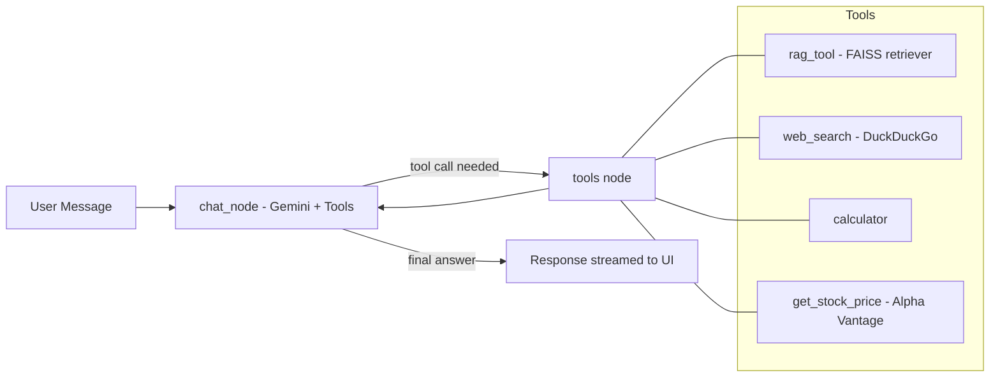

# 📄 DocuChat — Multi-Tool RAG Chatbot

A conversational AI assistant that lets you **chat with your PDFs**, search the web, fetch live stock prices, and run calculations — all in one multi-threaded chat interface with persistent memory.

Built with **LangGraph** for stateful agent orchestration, **Google Gemini** for generation and embeddings, **FAISS** for vector retrieval, and **Streamlit** for the UI.

---

## ✨ Features

- **📚 Chat with your PDF** — Upload a document and ask questions grounded in its content using Retrieval-Augmented Generation (RAG).
- **🌐 Web Search** — Falls back to live DuckDuckGo search for questions beyond the uploaded document.
- **🧮 Calculator Tool** — Performs arithmetic (add, subtract, multiply, divide) on demand mid-conversation.
- **📈 Stock Price Lookup** — Fetches real-time stock quotes via Alpha Vantage.
- **🧵 Multi-Thread Conversations** — Each chat is an isolated thread with its own document context and history.
- **💾 Persistent Memory** — Conversations are checkpointed to SQLite, so past threads survive app restarts.
- **🛠️ Tool-Use Transparency** — The UI streams live status updates ("Using `rag_tool`…") whenever the agent calls a tool.
- **🔎 LLM Observability** — Every agent run is traced with **LangSmith**, making it easy to debug tool calls, inspect prompts, and monitor latency/token usage.

---

## 🏗️ Architecture

The core is a LangGraph **state graph** with a single conditional loop: the LLM node decides whether to answer directly or call a tool, and routes back until it produces a final response.



Each chat thread gets its own **FAISS retriever** (built at PDF upload time) and its own **SQLite checkpoint**, so multiple conversations and documents never interfere with each other.

---

## 🧰 Tech Stack

| Layer            | Technology                                      |
|-------------------|--------------------------------------------------|
| LLM               | Google Gemini 2.5 Flash (`langchain-google-genai`) |
| Embeddings        | Gemini Embedding (`gemini-embedding-001`)        |
| Agent Framework   | LangGraph                                        |
| Vector Store      | FAISS                                            |
| PDF Parsing       | PyPDFLoader (`langchain-community`)              |
| Web Search        | DuckDuckGo Search Tool                           |
| Persistence       | SQLite (`langgraph-checkpoint-sqlite`)           |
| Frontend          | Streamlit                                        |
| Observability     | LangSmith (tracing & debugging)                  |

---

## 📁 Project Structure

```
.
├── chatbot_frontend.py                      # Streamlit frontend (UI, chat, sidebar, streaming)
├── chatbot_backend.py     # LangGraph agent, tools, RAG pipeline, checkpointer
├── requirements.txt             # Python dependencies
├── .env                         # API keys (not committed)
└── chatbot.db                   # SQLite checkpoint store (auto-created)
```

---

## ⚙️ Setup & Installation

### 1. Clone the repository
```bash
git clone https://github.com/<your-username>/<your-repo>.git
cd <your-repo>
```

### 2. Create a virtual environment
```bash
python -m venv venv
source venv/bin/activate      # On Windows: venv\Scripts\activate
```

### 3. Install dependencies
```bash
pip install -r requirements.txt
```

### 4. Configure environment variables
Create a `.env` file in the project root:
```env
GOOGLE_API_KEY=your_google_generativeai_api_key
ALPHA_VANTAGE_API_KEY=your_alpha_vantage_api_key

# LangSmith (optional, for tracing & observability)
LANGCHAIN_TRACING_V2=true
LANGCHAIN_API_KEY=your_langsmith_api_key
LANGCHAIN_PROJECT=docuchat-pdf-chatbot
```


### 5. Run the app
```bash
streamlit run chatbot_frontend.py
```
The app will open at `http://localhost:8501`.

---

## 🚀 Usage

1. Click **New Chat** in the sidebar to start a fresh thread.
2. Upload a PDF from the sidebar — it's chunked, embedded, and indexed automatically.
3. Ask questions in the chat box:
   - *"Summarize section 2 of this document"* → uses the RAG tool
   - *"What's the latest news on OpenAI?"* → uses web search
   - *"What's 45 * 12?"* → uses the calculator
   - *"What's the current price of TSLA?"* → uses the stock price tool
4. Switch between past conversations from the **Past Conversations** panel — each retains its own document and history.

---

## 🔎 Observability with LangSmith

This project uses **[LangSmith](https://smith.langchain.com/)** to trace every agent run — including which tool was called, the exact prompt sent to Gemini, intermediate tool outputs, and latency per step.

To enable it, set the LangSmith environment variables shown above and log in to your [LangSmith dashboard](https://smith.langchain.com/). Once enabled, every run of `chatbot.stream(...)` / `chatbot.invoke(...)` is automatically traced under the project name set in `LANGCHAIN_PROJECT` — no extra code changes needed.

This was especially useful during development for:
- Debugging why the agent picked the wrong tool (e.g. web search instead of `rag_tool`)
- Inspecting retrieved chunks from FAISS before they reach the LLM
- Tracking token usage and latency across multi-turn conversations

---


## 📜 License

This project is open-sourced under the [MIT License](LICENSE).

---

## 🙌 Acknowledgements

Built using [LangGraph](https://github.com/langchain-ai/langgraph), [LangChain](https://github.com/langchain-ai/langchain), and [Streamlit](https://streamlit.io/).